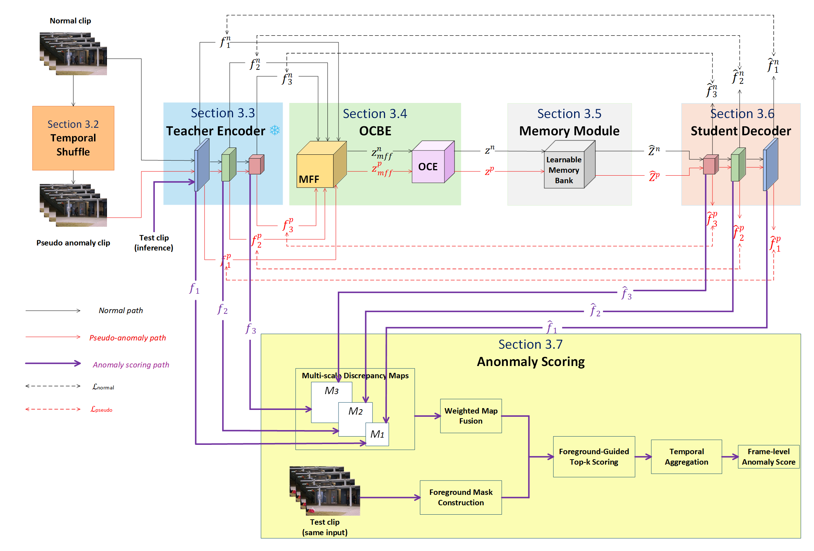

# ST-RD-VAD

Official PyTorch implementation of "Spatiotemporal Reverse Distillation with Memory-Augmented Pseudo-Anomaly Learning for Unsupervised Video Anomaly Detection".

## Overview

We propose a Spatiotemporal Reverse Distillation (ST-RD) framework with memory-augmented pseudo-anomaly learning for unsupervised video anomaly detection.

The framework employs a pretrained I3D network as a frozen teacher to extract multi-scale spatiotemporal features. These features are fused and compressed by a 3D One-Class Bottleneck Embedding (OCBE) module, followed by sparse memory retrieval and a 3D student decoder for hierarchical feature reconstruction.

During training, temporally shuffled clips generated exclusively from normal videos are used as pseudo-anomalies. During inference, multi-scale teacher–student discrepancy maps are combined with foreground-guided spatial and temporal aggregation to produce frame-level anomaly scores.

## Framework

<p align="center">  </p>

<p align="center"> <b>Overall architecture of the proposed ST-RD-VAD framework.</b> </p>

The proposed framework consists of six main components: temporal pseudo-anomaly generation, a frozen I3D teacher encoder, a 3D One-Class Bottleneck Embedding (OCBE) module, a learnable memory module, a 3D student decoder, and a foreground-guided temporal anomaly scoring module.

During training, a normal clip and its temporally shuffled pseudo-anomalous counterpart are processed by the same frozen I3D teacher encoder and the shared OCBE–memory–student pathway. The normal branch reconstructs the multi-scale teacher representations, while the pseudo-anomaly branch uses a margin-based objective to maintain sufficiently large teacher–student discrepancies for temporally corrupted clips.

During inference, the pseudo-anomaly branch is removed. Multi-scale teacher–student discrepancy maps are fused and combined with foreground information extracted from the test clip, followed by spatial and temporal aggregation to obtain the final frame-level anomaly scores.
## Environment

The code has been tested with the following environment:

* Python >= 3.8
* PyTorch >= 1.10
* CUDA >= 11.x

Other dependencies:

```text
numpy
opencv-python
scikit-learn
scipy
tqdm
tensorboard
```

A CUDA-enabled GPU is recommended for training and inference.

## Datasets

We evaluate the proposed method on three widely used video anomaly detection benchmarks:

* UCSD Ped2 [[Dataset](http://www.svcl.ucsd.edu/projects/anomaly/UCSD_Anomaly_Dataset.tar.gz)]
* CUHK Avenue [[Dataset](http://www.cse.cuhk.edu.hk/leojia/projects/detectabnormal/Avenue_Dataset.zip)]
* ShanghaiTech [[Dataset](https://svip-lab.github.io/dataset/campus_dataset.html)]

Only normal videos from the official training sets are used for model training. The benchmark test sets and their annotations are used only for final evaluation.

For frame-level evaluation, the corresponding ground-truth labels are provided in this repository:

```text id="ecaa02"
frame_labels_ped2.npy
frame_labels_avenue.npy
frame_labels_shanghai.npy
```

## Pretrained Model

We use an ImageNet-pretrained RGB I3D model as the teacher encoder.

* I3D RGB ImageNet pretrained model [[Download](https://github.com/piergiaj/pytorch-i3d/blob/master/models/rgb_imagenet.pt)]

## Region- and Track-Level Annotations

For RBDC/TBDC evaluation, please download the corresponding region- and track-level annotations from the following sources.

**UCSD Ped2 / CUHK Avenue**

* MERL region- and track-level ground-truth annotations [[Website](https://www.merl.com/research/highlights/video-anomaly-detection)]

**ShanghaiTech**

* ShanghaiTech annotations from the AED repository [[Annotations](https://github.com/lilygeorgescu/AED/tree/master/annotations/ShanghaiTech)]
* AED repository [[Download](https://github.com/lilygeorgescu/AED/archive/refs/heads/master.zip)]

## Repository Structure

```text
ST-RD-VAD/
├── evaluation/                   # RBDC/TBDC evaluation
├── I3D_model.py                  # I3D teacher network
├── collect_validation_results.py # Collect validation results
├── data.py                       # Data loading and preprocessing
├── frame_labels_avenue.npy       # Frame-level labels for CUHK Avenue
├── frame_labels_ped2.npy         # Frame-level labels for UCSD Ped2
├── frame_labels_shanghai.npy     # Frame-level labels for ShanghaiTech
├── framework.png                 # Framework overview
├── loss.py                       # Loss functions
├── memory.py                     # Memory module
├── model.py                      # ST-RD-VAD model
├── test.py                       # Testing script
├── train.py                      # Training script
├── utils.py                      # Utility functions
├── validation.py                 # Training-derived validation
└── README.md
```

## Training/Inference

Train the model with `train.py`:

```bash
python train.py --dataset_type ped2
```

Evaluate the model with `test.py`:

```bash
python test.py
```

For other datasets, set `dataset_type` to `avenue` or `shanghai`.

## RBDC/TBDC Evaluation

In addition to frame-level AUC, we report the **Region-Based Detection Criterion (RBDC)** and **Track-Based Detection Criterion (TBDC)** for spatial and track-level evaluation.

The corresponding evaluation scripts are provided in the `evaluation/` directory:

```text
evaluation/
├── evaluate_rbdc_tbdc.py
├── rbdc_tbdc_metrics.py
└── test_rbdc_tbdc.py
```

For UCSD Ped2 and CUHK Avenue, please use the region- and track-level annotations provided by MERL. For ShanghaiTech, please use the annotations released with the AED repository. The download links are provided in the [Region- and Track-Level Annotations](#region--and-track-level-annotations) section above.

The evaluation follows the standard protocol with an IoU threshold of **0.1** for region matching and a **10%** detection threshold for anomalous tracks.

